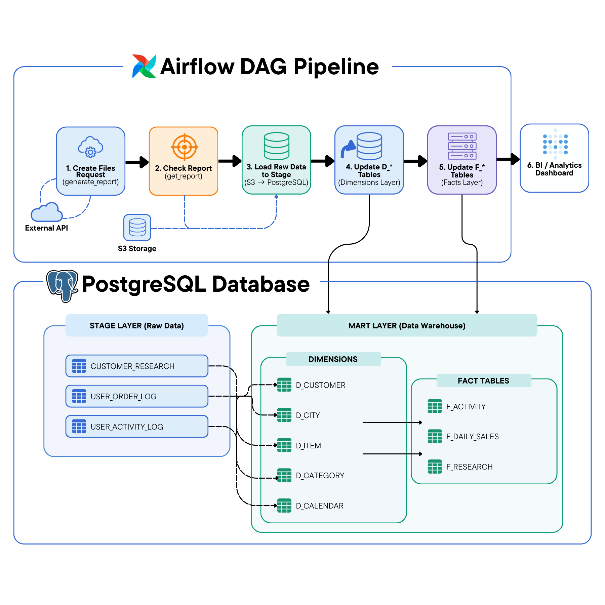
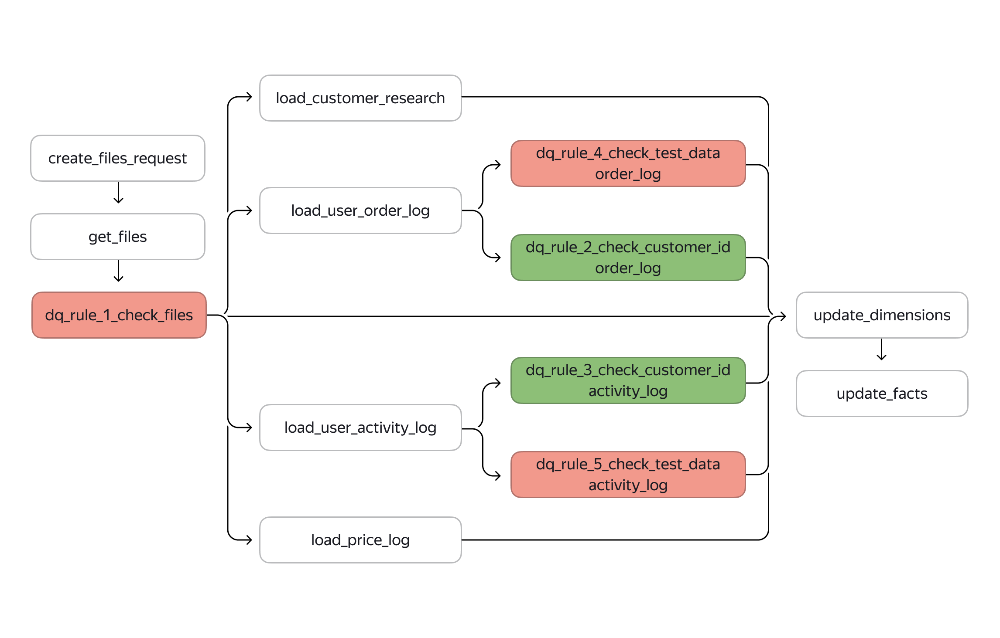

# Data Pipeline Project (Airflow + PostgreSQL)

This project implements a complete **data pipeline for sales analytics**, built using **Apache Airflow**, **PostgreSQL**, and **Python**.

The pipeline extracts raw data from an external API, loads it into a staging layer, transforms it into a dimensional data warehouse model, and generates analytical marts for business intelligence.

The project also demonstrates **schema evolution**, **incremental loading**, and **backward compatibility** in a production-style data pipeline.

---

# Architecture Overview

The pipeline follows a **layered data warehouse architecture**:




Pipeline orchestration is handled by **Apache Airflow**.

---

# Pipeline Architecture


---

## Pipeline Version 1 (Initial Implementation)

The first version of the pipeline performs the following steps:

### 1. Data Extraction
Airflow sends a request to the external API to generate a report containing:

- `customer_research.csv`
- `user_order_log.csv`
- `user_activity_log.csv`
- `price_log.csv`

The pipeline waits until the report is ready and retrieves the files from object storage.

---

### 2. Staging Layer

Raw data is loaded into PostgreSQL staging tables:

staging.customer_research
staging.user_order_log
staging.user_activity_log


This layer stores **raw, unprocessed data**.

---

### 3. Data Warehouse (Mart Layer)

Data is transformed into a dimensional model.

#### Dimension Tables

mart.d_customer
mart.d_city
mart.d_item
mart.d_category
mart.d_calendar


#### Fact Tables

mart.f_activity
mart.f_daily_sales
mart.f_research


These tables support analytical queries and reporting.

---

## Pipeline Version 2 (Pipeline Update)

Later, the source system introduced **order refunds**, which required updating the pipeline.

Two major changes were implemented.

---

### 1️. Schema Evolution

The source data was extended with a **new column describing order status**.

Migration:

```sql
ALTER TABLE staging.user_order_log
ADD COLUMN status VARCHAR(50);
```

Possible values:

**shipped**
**refunded**

To maintain backward compatibility, if incoming data does not contain a status column, the pipeline assigns:

status = **'shipped'**

---

### 2. Updated Sales Fact Table

The existing fact table mart.f_daily_sales was updated to support refunds.

Revenue logic:
| Status   | Amount           |
| -------- | ---------------- |
| shipped  | positive revenue |
| refunded | negative revenue |

This ensures that total revenue metrics remain correct when aggregated.

---

### 3. New Analytical Mart

To support product and marketing analysis, a new data mart was introduced:

mart.f_customer_retention

This mart tracks customer retention metrics on a weekly basis.

### Metrics included

- number of new customers
- number of returning customers
- number of refunded customers
- revenue from new customers
- revenue from returning customers
- number of refunds

---

# Airflow DAG 

The final pipeline DAG performs the following steps:

generate_report
     ↓
get_report
     ↓
get_increment
     ↓
load_increment_to_staging
     ↓
update_dimensions
     ↓
update_f_daily_sales
     ↓
update_f_customer_retention

This ensures that the warehouse is updated with incremental data.

## Technologies Used

- **Apache Airflow** — workflow orchestration  
- **PostgreSQL** — data warehouse  
- **Python** — ETL logic  
- **Pandas** — data processing  
- **REST API** — data source  
- **Object Storage (S3)** — file storage  

## Running the Project with Docker

The project is designed to run inside a Docker environment.

Docker is used to run the following services:

- Apache Airflow
- PostgreSQL database

This allows the pipeline to run in an isolated and reproducible environment.

### Start the Environment

```bash
docker-compose up -d
```

---

## Key Features

- Incremental data loading  
- API-based data ingestion  
- Dimensional data modeling (star schema)  
- Schema evolution support  
- Backward compatibility  
- Analytical data mart creation  
- Airflow DAG orchestration  


---

## Future Improvements

Possible next steps for the pipeline:

- add automated **data quality checks**
- implement **data validation**
- add **partitioning for fact tables**
- introduce **dbt for transformations**
- deploy the pipeline to a **cloud environment**


---

## Data Quality Layer (DQ Checks)

The pipeline was extended with a dedicated Data Quality (DQ) layer to ensure data reliability before loading into the data warehouse.



### Implemented DQ Rules

- **File availability check**
  - Ensures that increment data exists before processing

- **NULL checks**
  - Validates that `customer_id` is not NULL in:
    - `staging.user_order_log`
    - `staging.user_activity_log`

- **Test data filtering**
  - Detects and blocks test or corrupted records:
    - `status LIKE '%test%'`
    - `item_name LIKE '%test%'`

- **Data validation logging**
  - All DQ results are stored in a dedicated table:
  
```sql
dq_checks_results (
    table_name,
    check_name,
    check_date,
    check_result
)
```

---

## Author

### Denis Evmenenko

Data Engineering portfolio project demonstrating **ETL pipeline development**, **data warehouse modeling**, and **Airflow orchestration**.
